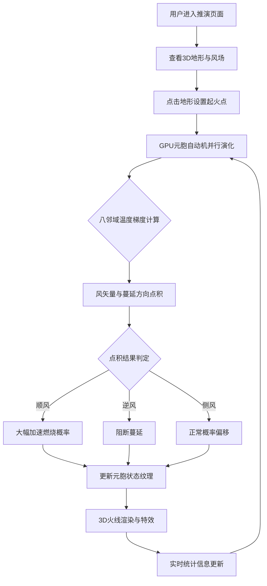

## 1. 产品概述

林火蔓延态势推演模拟器 — 一款基于 GPU 并行计算的硬核森林火灾扩散仿真平台。利用 WebGL2 Fragment Shader 的 FBO Ping-Pong 技术，将元胞自动机状态演化与风场偏置计算完全下放至 GPU，实现数十万级林地网格的实时推演与 3D 可视化。

- 面向林火研究人员、应急指挥决策者及仿真爱好者，提供直觉式火线推进与风场交互可视化
- 核心价值：实时、物理可信的林火蔓延模拟，支持动态风场编辑与多参数调参

## 2. 核心功能

### 2.1 用户角色

| 角色 | 使用方式 | 核心权限 |
|------|----------|----------|
| 操作员 | 直接访问 | 地形点火、风场编辑、参数调节、推演控制 |
| 观察者 | 直接访问 | 实时观看推演过程、查看统计信息 |

### 2.2 功能模块

1. **推演主页面**：3D 地形 + 火线可视化 + 风场叠加层 + 控制面板
2. **参数配置面板**：可燃物载量、风速风向、湿度、燃烧概率等实时调节

### 2.3 页面详情

| 页面名称 | 模块名称 | 功能描述 |
|----------|----------|----------|
| 推演主页面 | 3D 地形场景 | Three.js 渲染地形网格，支持旋转/缩放/平移，火焰粒子与火线光晕叠加 |
| 推演主页面 | 元胞自动机引擎 | GPU Fragment Shader 实现 512×512 网格的状态演化，八邻域温度梯度传播 |
| 推演主页面 | 风场矢量层 | 全局二维风场流体图，支持鼠标绘制风场矢量，实时影响火线偏置 |
| 推演主页面 | 火线渲染特效 | 基于风向点积的方向性火线推进特效，顺风加烈、逆风阻断的视觉表现 |
| 推演主页面 | 控制面板 | 播放/暂停/重置，点火工具（点击地形起火），参数滑块调节 |
| 推演主页面 | 统计信息栏 | 实时燃烧面积、蔓延速率、风向角度等数值显示 |

## 3. 核心流程

1. 用户进入推演页面，看到 3D 地形场景与风场叠加
2. 通过点击地形设置起火点，火势基于元胞自动机规则在 GPU 中并行演化
3. 风场矢量实时影响蔓延偏置：风向点积决定加速或阻断
4. 用户可动态调节风速/风向/湿度等参数，实时观察火线响应
5. 推演过程中可随时重置或修改起火点

## 4. 用户界面设计

### 4.1 设计风格

- **主色调**：深黑底色（#0a0a0f）配烈焰橙红渐变（#ff4500 → #ff8c00）作为强调色，模拟夜间林火指挥氛围
- **辅助色**：灰绿色（#4a6741）代表植被/未燃区域，炭灰色（#2a2a2a）代表灰烬
- **按钮风格**：圆角微光玻璃态（Glassmorphism），橙红色 hover 高亮
- **字体**：显示字体用 Rajdhani（科技感），正文用 IBM Plex Mono（数据密集）
- **布局**：全屏 3D 视图为主，右侧半透明控制面板浮层，底部统计条
- **动效**：控制面板展开/收起有毛玻璃模糊过渡，参数滑块有微光追踪效果

### 4.2 页面设计概览

| 页面名称 | 模块名称 | UI 元素 |
|----------|----------|---------|
| 推演主页面 | 3D 地形场景 | Three.js 全屏 Canvas，高度图地形 + 正射投影火线贴图叠加，OrbitControls 旋转缩放 |
| 推演主页面 | 风场叠加层 | 半透明箭头/流线可视化风场方向与强度，颜色编码风速 |
| 推演主页面 | 控制面板 | 右侧浮层：播放/暂停/重置按钮组，点火模式切换，风速/风向/湿度/可燃物载量滑块，网格分辨率选择 |
| 推演主页面 | 统计信息栏 | 底部窄条：燃烧面积百分比、蔓延速率(m/s)、当前风向、活跃火点数 |
| 推演主页面 | 火线特效 | Shader 渲染方向性火线：顺风方向拖尾粒子，逆风方向火焰收缩，燃烧区橙红光晕 |

### 4.3 响应式设计

- 桌面端优先：全屏 3D + 右侧面板
- 平板端：面板折叠为底部抽屉
- 移动端：3D 视图全屏，面板为覆盖式模态

### 4.4 3D 场景指引

- **环境/氛围**：深夜林地，微弱环境光 + 火源自发光，营造紧张感
- **光照**：低角度方向光模拟月光，火焰区域自发光点光源
- **相机**：45° 俯角默认视角，OrbitControls 自由旋转，支持近地面漫游
- **构图与焦点**：火线前沿为核心焦点，风场箭头引导视线方向
- **交互与动画**：点击地形起火，鼠标拖拽编辑风场，参数变化实时反映
- **后处理**：Bloom 效果增强火焰光晕，轻微色差模拟热空气折射
- **性能预算**：512×512 网格（262,144 元胞）@60fps，Shader 计算与渲染分离
