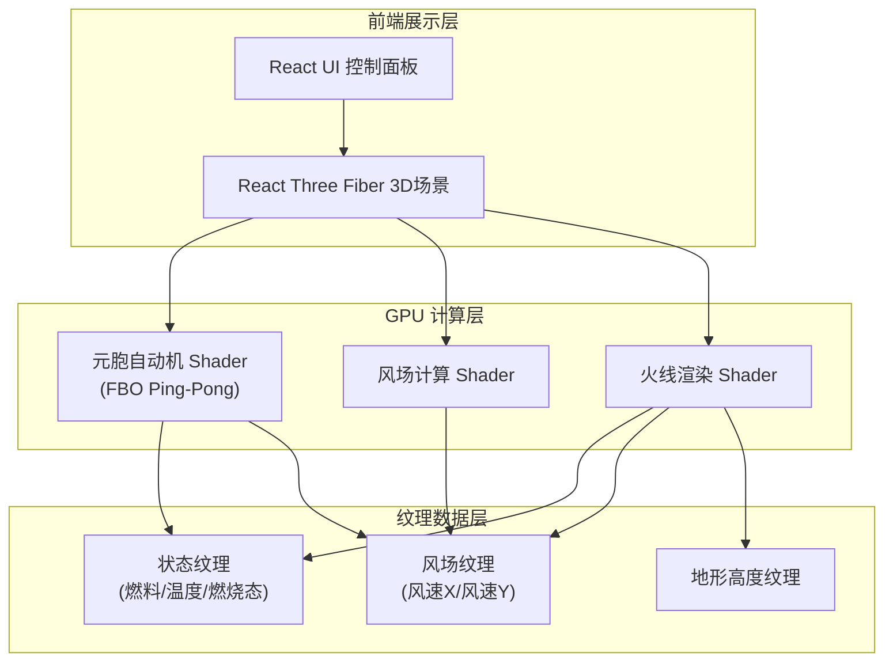

## 1. 架构设计



## 2. 技术说明

- **前端框架**：React@18 + TypeScript + Vite
- **3D 渲染**：Three.js + @react-three/fiber + @react-three/drei + @react-three/postprocessing
- **GPU 计算**：WebGL2 Fragment Shader + FBO Ping-Pong（模拟 Compute Shader）
- **状态管理**：Zustand
- **样式**：Tailwind CSS 3
- **初始化工具**：vite-init (react-ts 模板)
- **后端**：无（纯前端模拟器）

### 核心技术决策

1. **FBO Ping-Pong 替代 Compute Shader**：WebGL2 不原生支持 Compute Shader，通过双 FBO 交替读写实现并行状态更新。每个 Fragment 对应一个元胞，采样邻居纹理获取八邻域数据，计算后写入输出 FBO。

2. **多通道渲染分离计算与显示**：
   - **Pass 1 (CA Update)**：元胞自动机状态演化 — 读取当前状态纹理 + 风场纹理，输出新状态
   - **Pass 2 (Wind Update)**：风场动态更新（可选，当前为静态风场 + 用户交互修改）
   - **Pass 3 (Fire Render)**：将状态纹理映射到 3D 地形表面，叠加火焰特效

3. **状态纹理编码**（RGBA Float Texture）：
   - R: 可燃物载量 (0.0~1.0)
   - G: 温度 (0.0~1.0，超过阈值点燃)
   - B: 燃烧状态 (0.0=未燃, 0.5=燃烧中, 1.0=灰烬)
   - A: 燃烧进度 (0.0~1.0，燃烧中逐步消耗燃料)

## 3. 路由定义

| 路由 | 用途 |
|------|------|
| / | 推演主页面 — 3D 场景 + 控制面板 + 风场编辑 |

## 4. Shader 架构

### 4.1 元胞自动机更新 Shader (ca-update.frag)

```
输入：uStateTexture (当前状态), uWindTexture (风场), uParams (参数uniform)
输出：gl_FragColor = 新状态 (RGBA)

核心逻辑：
1. 采样自身状态 (fuel, temp, burnState, burnProgress)
2. 采样八邻域纹理坐标偏移 (dx, dy = 1/resolution)
3. 对每个邻居：
   a. 获取邻居温度与燃烧状态
   b. 计算本点到邻居的方向向量 dir = normalize(neighbor - self)
   c. 采样风场纹理获取 windVec
   d. 点积 dot(windVec, dir) → windBias
   e. 温度传播量 = neighborTemp * decay * (1.0 + windBias * windStrength)
   f. 累加温度增量
4. 若自身未燃且温度 > ignitionThreshold → 点燃
5. 若燃烧中 → burnProgress += burnRate, fuel -= consumptionRate
6. 若燃料耗尽 → 转灰烬
```

### 4.2 风场纹理

- 分辨率与 CA 网格相同 (512×512)
- RG 通道编码风向 (R=x分量, G=y分量)，归一化后乘以风速标量
- 用户通过鼠标拖拽在风场纹理上绘制/修改矢量

### 4.3 火线渲染 Shader (fire-render.frag)

```
输入：uStateTexture, uWindTexture, uTime
输出：带方向性特效的火焰颜色

核心逻辑：
1. 采样燃烧状态与风场
2. 未燃区域 → 植被色（灰绿）
3. 灰烬区域 → 炭灰色
4. 燃烧区域：
   a. 基础火焰色 = 橙红渐变 (基于温度)
   b. 风向偏置 = 沿风向拉伸火焰纹理坐标 (UV偏移)
   c. 顺风方向 → 拖尾辉光，逆风方向 → 压缩
   d. 叠加噪声扰动模拟火焰闪烁
5. 火焰区域 Bloom 后处理增强光晕
```

## 5. 数据模型

### 5.1 Zustand Store 定义

```typescript
interface SimulationStore {
  isRunning: boolean
  resolution: number
  ignitionThreshold: number
  burnRate: number
  fuelConsumptionRate: number
  windStrength: number
  windDirection: number
  humidity: number
  resetTrigger: number
  toggleRunning: () => void
  reset: () => void
  setParam: (key: string, value: number) => void
}
```

### 5.2 GPU 纹理数据

| 纹理名称 | 格式 | 用途 |
|----------|------|------|
| stateA / stateB | RGBA32F | 元胞状态双缓冲 (燃料/温度/燃烧态/进度) |
| windField | RG32F | 风场矢量 (X/Y分量) |
| heightMap | R32F | 地形高度图 |
| ignition | R8 | 点火遮罩 (用户点击标记) |
